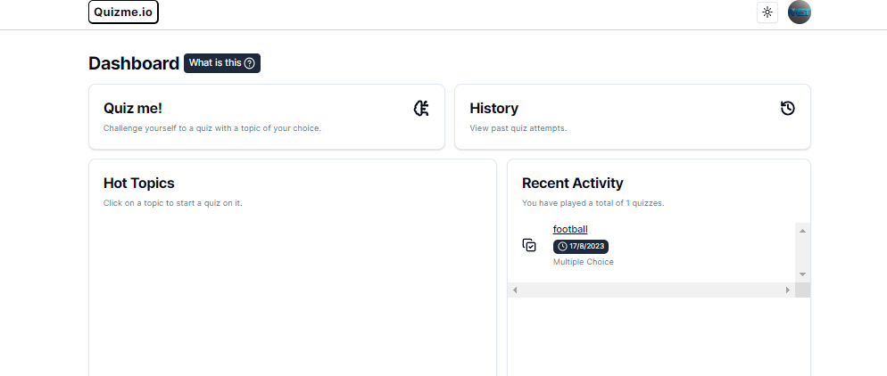

# Quizme: AI-based Quiz App

Quizme is an innovative quiz application that leverages AI-powered features to enhance the quiz-taking experience. With the combination of Next.js, Typescript,  OpenAI ChatGPT, React Query, Tailwind CSS, Shadcn/UI, and Prisma ORM, Quizme offers a seamless and user-friendly interface for creating and taking quizzes.



## Features

- **AI-Powered Questions**: Quizme uses OpenAI ChatGPT to generate intelligent and dynamic quiz questions, making each quiz unique and engaging.

- **Responsive Design**: The app is built with a responsive design using Tailwind CSS, ensuring a great user experience across various devices.

- **Fast and Efficient**: Leveraging React Query, Quizme fetches and manages data seamlessly, providing fast and efficient interactions.

- **Intuitive UI Components**: Shadcn/UI components are integrated to enhance the visual appeal and interactivity of the app.

## Getting Started

Follow these steps to set up and run Quizme on your local machine:

1. Clone the repository:

   ```bash
   git clone https://github.com/muhammedhashimcp/Quizme.git
   cd Quizme
   ```

2. Install dependencies:

   ```bash
   npm install
   ```

3. Set up environment variables:
   Create a `.env` file in the project root from `.env.example` and  add your env :

   ```
   DATABASE_URL=
   GOOGLE_CLIENT_ID=
   GOOGLE_CLIENT_SECRET=
   NEXTAUTH_SECRET=
   OPENAI_API_KEY=
   API_URL='http://localhost:3000'
   ```

4. Create an account in planetscale and add the url here 

   ```
   DATABASE_URL=
   ```

5. Create a Google Cloud authentication (auth) ID account for our project.

   ```
   GOOGLE_CLIENT_ID=
   GOOGLE_CLIENT_SECRET=
   ```
6. create a open ai account and generate a key

   ```
   OPENAI_API_KEY=

   ```

7. Put any nextauth secret here.

   ```
  NEXTAUTH_SECRET=

   ```

8. sync database with prisma orm:
   
   ```
   npx prisma generate
   npx prisma db push
   npx prisma studio

   ```

   For more details visit : https://www.prisma.io/docs/
   More practical guide here: https://blog.openreplay.com/working-with-databases-in-next-js-using-prisma/

9. Run the development server:

   ```
   npm run dev
   ```

10. Open your browser and navigate to `http://localhost:3000` to access Quizme.

## Usage

1. Create a Quiz:
   - Click on the "Create Quiz" button.
   - Provide a title and select the number of questions for your quiz.
   - Quizme will use OpenAI ChatGPT to generate AI-powered questions for your quiz.

2. Take a Quiz:
   - Choose a quiz from the list of available quizzes.
   - Answer the questions presented, and Quizme will provide instant feedback.

3. Explore More:
   - Play around with the app, explore different quizzes, and experience the AI-generated questions.

## Contributions and Feedback

Contributions and feedback are welcome! If you encounter any issues or have suggestions for improvements, please create an issue or submit a pull request.

## Acknowledgements

Quizme is made possible by the following technologies:

- [Next.js](https://nextjs.org/)
- [OpenAI](https://openai.com/)
- [Tailwind CSS](https://tailwindcss.com/)
- [React Query](https://react-query.tanstack.com/)
- [Shadcn/UI](https://github.com/shadcn/ui)

